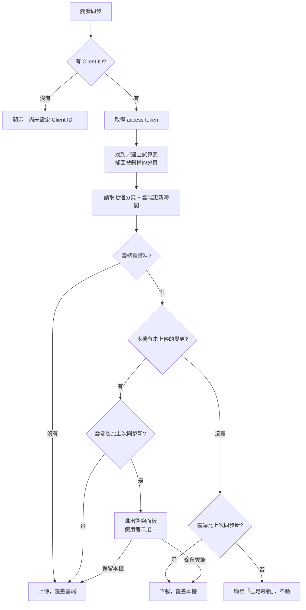

# Google 試算表同步：設定與運作流程

財務管家沒有自己的伺服器，也沒有共用資料庫。**「後端資料庫」就是使用者自己
Google 雲端硬碟裡的一份試算表**，App 直接用 OAuth + Sheets API 讀寫它。

好處是零維運成本、資料主權在使用者手上、隨時可以在 Sheets 裡拉樞紐分析；
代價是同步以「整份文件」為單位，不做逐筆合併（見[限制](#限制)）。

程式碼：[`pwa/sync.js`](pwa/sync.js)、設定：[`pwa/config.js`](pwa/config.js)、
介面樣板：[`pwa/sync-ui.html`](pwa/sync-ui.html)、[`pwa/sync-conflict.html`](pwa/sync-conflict.html)

---

## 一、架構

```
瀏覽器（PWA）
  ├─ localStorage ──── 主儲存，離線照常記帳
  └─ sync.js ───────── OAuth token（只放記憶體）
                          │
                          ↓ HTTPS
              Google Sheets API / Drive API
                          │
                          ↓
        使用者自己雲端硬碟裡的「財務管家資料」試算表
```

三個要點：

- **離線優先。** localStorage 是主要儲存，同步是額外一層。斷網、沒設定 Client ID、
  使用者不連接雲端，App 全部功能照常運作。
- **沒有共用端點。** 每個使用者連的是自己的檔案，彼此看不到對方的資料，
  也沒有一台伺服器持有所有人的帳目。
- **最小權限。** 只要 `drive.file` 範圍，App 只碰得到自己建立的那個檔案，
  看不到雲端硬碟其他任何內容。

---

## 二、一次性設定（開發者做，只做一次）

到 [Google Cloud Console](https://console.cloud.google.com/)：

### 1. 建立專案並啟用 API

「API 和服務」→「已啟用的 API 和服務」→「啟用 API 和服務」，啟用兩個：

- **Google Sheets API**
- **Google Drive API**

### 2. OAuth 同意畫面

- 使用者類型選 **External（外部）**
- 應用程式名稱、支援電子郵件、開發人員聯絡資訊照實填
- **範圍只加 `https://www.googleapis.com/auth/drive.file`**

  > ⚠️ 不要加 `https://www.googleapis.com/auth/spreadsheets`。那是敏感範圍，
  > 會被要求提交審查（要錄影、要隱私權政策網址），流程長達數週。
  > `drive.file` 是非敏感範圍，不用審查，而且已經足夠讀寫 App 自己建立的檔案。

- 建立完成後按 **「發布應用程式」**（Publish App）。
  停在「測試中」狀態的話，只有你手動加進測試使用者清單的帳號能登入，
  其他人會看到 `access_denied`。

### 3. 建立 OAuth 用戶端 ID

「憑證」→「建立憑證」→「OAuth 用戶端 ID」→ 應用程式類型選 **網頁應用程式**：

| 欄位 | 填什麼 |
| --- | --- |
| 已授權的 JavaScript 來源 | `https://charliersa.github.io`<br>`http://localhost:8765` |
| 已授權的重新導向 URI | **留空** |

只填到來源（origin）為止，不要帶路徑。子路徑部署（例如
`https://example.com/money/`）也只填 `https://example.com`。

換部署網址時，記得回來把新的來源加進去，否則會拿到
`origin mismatch` 之類的授權錯誤。

### 4. 填進設定檔

把拿到的用戶端 ID（形如 `1234567890-abc.apps.googleusercontent.com`）
填進 [`pwa/config.js`](pwa/config.js)：

```js
window.APP_CONFIG = {
  googleClientId: '1234567890-abc.apps.googleusercontent.com',
  spreadsheetName: '財務管家資料',   // 第一次連線時建立的檔名
};
```

沒填的話 App 照常運作，設定頁的「雲端同步」會顯示「尚未設定 Client ID」。

### 5. 部署

把 [`pwa/sw.js`](pwa/sw.js) 開頭的 `VERSION` 加一（`v2` → `v3`），
否則已安裝的使用者會繼續吃舊快取、拿不到新的 `config.js`。

推上 `main` 後由 [`.github/workflows/deploy-pages.yml`](.github/workflows/deploy-pages.yml)
自動發佈。

---

## 三、使用者端流程

1. 開啟 App →「設定」→「雲端同步」→ 按 **「連接 Google 帳號」**
2. 跳出 Google 授權視窗，選帳號、同意授權
3. App 在使用者的雲端硬碟建立「財務管家資料」試算表，分成七個分頁
4. 之後每次資料變動會自動同步，設定頁可以看到「最後同步：今天 14:32」
5. 「在 Google 試算表開啟 →」可以直接跳到那份檔案

**自動同步開關**關掉後只剩手動的「立即同步」按鈕，其他行為不變。
**「中斷連接」**只清掉記憶體裡的 token 與連線狀態，不會刪除雲端檔案，
也不會清掉本機資料。

---

## 四、同步流程

### 何時觸發

| 時機 | 說明 | 程式位置 |
| --- | --- | --- |
| 資料變動後 8 秒 | 每次 `save()` 重設計時器，連續操作只會送一次 | [`sync.js:407-411`](pwa/sync.js#L407-L411) |
| 切到背景時 | `visibilitychange` → hidden，有未上傳變更就立刻送 | [`sync.js:497-503`](pwa/sync.js#L497-L503) |
| 恢復連線時 | `online` 事件 | [`sync.js:504-506`](pwa/sync.js#L504-L506) |
| 開啟 App 時 | 之前連過就靜默取回 token 並同步一次 | [`sync.js:489-495`](pwa/sync.js#L489-L495) |
| 手動 | 設定頁的「立即同步」 | [`sync.js:445`](pwa/sync.js#L445) |

### 決策邏輯

比對三個時間戳：雲端「設定」分頁的 `更新時間`、本機的 `lastSyncAt`、
本機最後一次資料變動的 `localChangedAt`。



**只有兩邊都改過時才會問使用者**，其餘情況自動處理，任何一邊的資料都不會被靜靜蓋掉。

### 寫入方式

上傳是 `batchClear`（清空所有資料列）→ `batchUpdate`（寫入表頭＋新資料）。
先清空是必要的，否則本機刪掉的交易會以殘留列的形式留在雲端。

副作用：**在試算表裡自己加的欄位、公式、格式化，下次上傳時會被清掉。**
要做分析的話請另開一個分頁用 `IMPORTRANGE` 或直接引用，不要改這七個分頁。

### Token 處理

- access token 只放在記憶體，**不寫進 localStorage**
- 過期前 60 秒視為失效，自動用 `prompt: ''` 靜默續期（使用者仍登入 Google 時不跳視窗）
- API 回 401 時清掉 token 重試一次，仍失敗才報錯
- localStorage 的 `financeapp_sync_v1` 只存 `spreadsheetId`、`lastSyncAt`、
  `localChangedAt`、`auto` 四個非機密欄位

---

## 五、試算表結構

第一次連線時建立七個分頁。**第 1 列是表頭，資料從第 2 列開始**，
欄位順序不能調換。

| 分頁 | 欄位 |
| --- | --- |
| **交易** | `id`｜`日期`｜`類型`｜`類別`｜`金額`｜`帳戶`｜`備註` |
| **預算** | `類別`｜`每月上限`｜`備註` |
| **資產** | `類別`｜`基準金額`｜`圖示`｜`自訂`｜`自訂ID`｜`基準時間` |
| **資產異動** | `id`｜`類別`｜`原金額`｜`新金額`｜`日期`｜`時間` |
| **保單** | `id`｜`名稱`｜`險種`｜`公司`｜`保費`｜`繳別`｜`到期日` |
| **帳戶** | `名稱`｜`連動資產` |
| **設定** | `項目`｜`值`（更新時間／姓名／電子郵件／月收入／深色模式／預設帳戶） |

### 手動編輯的規則

可以直接在 Sheets 裡改資料，但要遵守格式，否則讀回來會走預設值：

- **`類型`** 欄必須是 `收入` 或 `支出`。填別的一律當成支出。
- **`自訂`** 欄必須是 `Y` 或 `N`。`Y` 表示這是使用者自訂的資產類別，
  此時 `圖示` 和 `自訂ID` 才有意義。
- **`連動資產`** 欄填資產分頁裡的類別名稱，代表這個帳戶的收支會直接加減
  該類別的金額。填 `不連動` 表示只記在帳簿、不動資產。**留空是「沒設定過」**，
  App 會套用預設值（一般帳戶連到「現金 & 存款」，`信用卡` 不連動）。
- **`基準金額`／`基準時間`** 是資產連動的起點：畫面上顯示的金額 ＝
  基準金額 ＋ 基準時間之後、記在連動帳戶上的所有收支。基準時間是毫秒時間戳
  （和交易的 `id` 同一個時間軸），由 App 在每次手動校正資產金額時寫入，
  **不建議手改**。留空的話 App 讀回來會補上「現在」，等同於「從此刻開始連動」。
- **日期** 維持既有格式（`YYYY-MM-DD`）。
- **沒有日期、或金額 ≤ 0 的交易列會被丟棄**；沒有名稱的保單、
  沒有類別的資產異動同理。
- 整個分頁清空不等於「刪光」：預算、資產、帳戶三個分頁若讀到空的，
  會**保留本機原本的值**而不是清空，避免誤刪。要清空請在 App 裡操作。

> ⚠️ **手動編輯後必須同時把「設定」分頁的 `更新時間` 改成一個更新的時間戳
> （ISO 格式，例如 `2026-09-03T14:30:00.000Z`），否則 App 不會認為雲端有變更，
> 你的手動編輯不會被讀回來，而且下次本機一有變動就會被覆蓋掉。**
>
> 這是因為同步的判斷完全依賴這個欄位，Sheets 本身的檔案修改時間不在判斷之內。

---

## 六、疑難排解

| 畫面上的訊息 | 原因與處理 |
| --- | --- |
| 尚未設定 Client ID | [`pwa/config.js`](pwa/config.js) 的 `googleClientId` 是空的 |
| 授權視窗被關閉或被瀏覽器擋下 | 允許這個網站開啟彈出視窗，再按一次連接 |
| 你拒絕了授權 | 授權畫面按了取消 |
| 需要重新登入 Google | 帳號已登出或 session 過期，按「連接 Google 帳號」重新授權 |
| 連不到 Google 登入服務 | 網路問題，或擋廣告的擴充功能封鎖了 `accounts.google.com/gsi/client` |
| Google API 403 | 多半是 OAuth 同意畫面停在「測試中」沒發布，或這個網域不在「已授權的 JavaScript 來源」 |
| Google API 429 | 超過配額（每位使用者每分鐘 60 次寫入），等一分鐘 |
| 有衝突待處理 | 兩邊都改過，在跳出的面板選要保留哪一份 |

其他狀況：

- **改了 `config.js` 卻沒生效** — Service Worker 快取。把 `sw.js` 的 `VERSION` 加一，
  或在瀏覽器 DevTools → Application → Service Workers 按 Unregister 後重整。
- **在 Drive 裡把試算表改名或丟到垃圾桶** — App 靠檔名尋找檔案，
  改名後若本機的 `spreadsheetId` 也被清掉（換裝置、清除瀏覽資料），
  會找不到舊檔而**另外建立一份新的空試算表**。要改名的話兩邊一起改
  （`config.js` 的 `spreadsheetName`）。
- **在 Sheets 裡刪掉某個分頁** — 下次同步會自動補回來，但那個分頁的雲端資料已經沒了；
  若本機還在，會在下次上傳時寫回去。
- **iOS Safari 每次都要重按連接** — Safari 的第三方 Cookie 政策會讓靜默續期失效，
  目前沒有解法。

---

## 限制

- 同步是**整份文件層級**的二選一，不做逐筆合併。兩台裝置同時記帳、
  又都沒即時同步的話，衝突時只能選一邊。
- 每次 API 呼叫約 0.3～2 秒，資料量大時上傳會明顯變慢。
- Sheets API 配額：每位使用者每分鐘 60 次寫入。
- 上傳會清掉試算表裡的自訂欄位與公式（見[寫入方式](#寫入方式)）。
- Client ID 寫死在 `config.js`，換網址或給別人自架都要改程式再重新部署。
